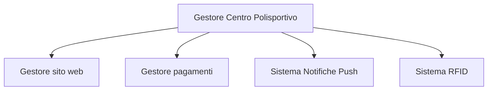
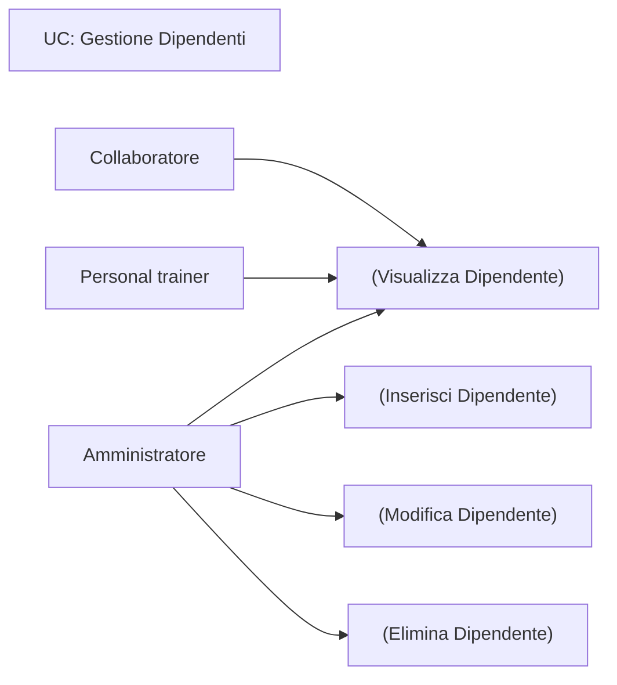

# Sistema di gestione di un centro polisportivo

## Progetto di Ingegneria del Software

## Sommario
1. [Descrizione dell’ambito di lavoro del sistema](#descrizione-dellambito-di-lavoro-del-sistema)
2. [Intervista al committente](#intervista-al-committente)
3. [Diagramma dei sistemi](#diagramma-dei-sistemi)
4. [Descrizione del sistema in linguaggio naturale](#descrizione-del-sistema-in-linguaggio-naturale)
5. [Glossario dei termini](#glossario-dei-termini)
6. [Analisi dei requisiti](#analisi-dei-requisiti)
    - [Requisiti Funzionali](#requisiti-funzionali)
    - [Requisiti Non funzionali](#requisiti-non-funzionali)
7. [Casi d’uso](#casi-duso)
    - [Gestione Dipendenti](#gestione-dipendenti)
    - [Gestione Clienti](#gestione-clienti)
    - [Gestione Campi](#gestione-campi)
    - [Gestione Palestra](#gestione-palestra)
    - [Gestione Movimenti](#gestione-movimenti)
8. [Diagramma complessivo dei casi d’uso](#diagramma-complessivo-dei-casi-duso)
9. [Matrice di Mapping](#matrice-di-mapping)
10. [Mappa dell’architettura](#mappa-dellarchitettura)
11. [Diagramma delle classi](#diagramma-delle-classi)
12. [Diagrammi attività](#diagrammi-attività)
13. [Diagramma delle sequenze](#diagramma-delle-sequenze)
14. [Mock-up](#mock-up)
15. [Test](#test)

## Descrizione dell’ambito di lavoro del sistema
Il progetto prevede lo sviluppo di un software per la gestione di un centro polisportivo. Il centro comprende una zona ristoro, diversi campi da gioco prenotabili dai clienti e una palestra accessibile con iscrizione. La gestione del software sarà rivolta al gestore del centro e ai suoi dipendenti. Il centro si compone di:

- 1 palestra (sala attrezzi)
- 2 campi da calcetto all’aperto
- 2 campi da calciotto
- 2 campi da tennis
- 2 campi da paddle

## Intervista al committente
Il team di sviluppo ha condotto un'intervista dettagliata con il committente per comprendere le esigenze del centro polisportivo. È emersa la necessità di un software gestionale che copra la gestione della palestra, la prenotazione dei campi da gioco e la registrazione dei movimenti di cassa. Inoltre, il software dovrebbe permettere la gestione dei dipendenti e l'accesso limitato alle funzionalità in base ai ruoli dei dipendenti.

## Diagramma dei sistemi
Il diagramma dei sistemi mostra l'interazione del software con altri sistemi, inclusi il sito web per le prenotazioni online future e il sistema RFID per il controllo degli accessi alla palestra.

## Descrizione del sistema in linguaggio naturale
Il sistema sarà suddiviso in quattro macro aree:

1. **Campi da gioco**:
    - Visualizzazione del calendario delle prenotazioni
    - Eliminazione e registrazione delle prenotazioni
    - Verifica del pagamento

2. **Gestione palestra**:
    - Inserimento e gestione dei clienti
    - Visualizzazione e modifica dei profili dei clienti
    - Registrazione degli ingressi giornalieri
    - Gestione degli abbonamenti e dei certificati medici

3. **Gestione dipendenti**:
    - Visualizzazione del calendario dei turni e delle attività
    - Inserimento, modifica ed eliminazione dei dipendenti

4. **Gestione movimenti cassa**:
    - Inserimento, visualizzazione, modifica ed eliminazione dei movimenti di cassa

## Glossario dei termini
| Termine | Descrizione | Tipo | Sinonimi |
|---------|-------------|------|----------|
| Campi da gioco | Superficie per praticare uno sport | Business | Campo/i |
| Palestra | Edificio con attrezzi per il fitness | Business | Sala pesi, sala fitness |
| Prenotazione | Azione per bloccare un servizio in una data e ora specifica | Business | Nessuno |
| Documento d’identità | Documento per l'identificazione della persona | Tecnico | Carta d’identità, patente |
| Attività | Praticare lo sport relativo al campo occupato | Business | Praticare tennis/paddle/calcetto/calciotto |
| Registrazione ingresso | Anagrafica della persona che entra in palestra senza abbonamento | Business | Nessuno |
| Abbonamento | Uso della palestra senza pagare ad ogni ingresso per un periodo definito | Business | Nessuno |
| Codice univoco | Codice numerico che identifica univocamente un abbonato | Tecnico | ID |
| Aggiornamento abbonamento | Rinnovo o modifica della durata di un abbonamento scaduto | Business | Rinnovo abbonamento |
| Attività da svolgere | Manutenzione e pulizia dei campi e della palestra | Business | Attività non ancora compiute |
| Aggiornare stato di un’attività | Passaggio dell'attività da "da svolgere" a "svolta" | Business | Nessuno |
| Turno | Orario di lavoro di un dipendente | Business | Nessuno |
| Profilo dipendente | Area contenente anagrafica, turni di lavoro e ruolo di un dipendente | Business | Scheda dipendente |
| Emolumento devoluto | Indicazione se lo stipendio è stato versato o meno | Business | Stipendio versato |
| Restrizioni | Limitazioni nel modificare il calendario in base al ruolo | Tecnico | Accessibilità limitata |
| Login | Accesso al software tramite credenziali | Tecnico | Accesso, autenticazione |
| Credenziali | Parole chiave per effettuare il login: nome utente e password | Tecnico | Nome utente e password |

## Analisi dei requisiti

### Requisiti Funzionali
| Requisito | Descrizione |
|-----------|-------------|
| RF-01 | Inserimento cliente: gestione dell'inserimento di un nuovo cliente |
| RF-02 | Visualizzazione cliente: gestione della visualizzazione di un cliente esistente |
| RF-03 | Modifica Cliente: gestione della modifica di un cliente esistente |
| RF-04 | Eliminazione cliente: gestione dell'eliminazione di un cliente |
| RF-05 | Inserimento dipendente: gestione dell'inserimento di un nuovo dipendente |
| RF-06 | Visualizzazione dipendente: gestione della visualizzazione di un dipendente |
| RF-07 | Modifica dipendente: gestione della modifica di un dipendente esistente |
| RF-08 | Eliminazione dipendente: gestione dell'eliminazione di un dipendente |
| RF-09 | Visualizzazione campo: gestione della visualizzazione di un campo da gioco |
| RF-10 | Inserimento prenotazione: gestione dell'inserimento di una nuova prenotazione |
| RF-11 | Visualizzazione prenotazione: gestione della visualizzazione di una prenotazione |
| RF-12 | Disdetta prenotazione: gestione della disdetta di una prenotazione |
| RF-13 | Inserimento abbonamento: gestione dell'inserimento di un nuovo abbonamento |
| RF-14 | Visualizzazione abbonamento: gestione della visualizzazione di un abbonamento |
| RF-15 | Inserimento ingresso giornaliero: gestione dell'inserimento di un ingresso una tantum |
| RF-16 | Inserimento certificato: gestione dell'inserimento di un nuovo certificato |
| RF-17 | Visualizzazione certificato: gestione della visualizzazione di un certificato |
| RF-18 | Inserimento movimento: gestione dell'inserimento di un nuovo movimento |
| RF-19 | Visualizzazione movimento: gestione della visualizzazione di un movimento |
| RF-20 | Modifica movimento: gestione della modifica di un movimento esistente |
| RF-21 | Eliminazione movimento: gestione dell'eliminazione di un movimento |

### Requisiti Non funzionali
| Requisito | Descrizione |
|-----------|-------------|
| RNF-01 | Disponibilità: il sistema deve essere disponibile tutti i giorni a tutte le ore. |
| RNF-02 | Accesso: il sistema deve permettere l'identificazione dell'utente. |
| RNF-03 | Autorizzazione: il sistema deve gestire le autorizzazioni dei diversi utenti. |
| RNF-04 | Registrazione: i clienti non abbonati devono essere registrati mediante documento di riconoscimento. |
| RNF-05 | Assegnazione Id: il sistema non deve consentire il riutilizzo di un id già esistente. |
| RNF-06 | Interfaccia grafica: l'interfaccia del sistema deve essere intuitiva nell'utilizzo. |
| RNF-07 | Privacy: il sistema deve implementare le disposizioni sulla privacy dei clienti e rispettare le norme anti Sars-CoV-2 secondo le linee guida elaborate dall’Ufficio per lo Sport della Presidenza del Consiglio dei Ministri nell'Allegato 17 del DPCM del 17 maggio 2020. |

## Casi d’uso
### Gestione Dipendenti

#### Inserisci Dipendente
**Descrizione**: Questo caso d’uso si verifica quando l’amministratore deve aggiungere un dipendente al sistema.

**Pre-condizioni**: L’utilizzatore ha effettuato correttamente il login. Il dipendente non esiste a sistema.

**Post-condizioni**: Il dipendente esiste a sistema.

**Sequenza degli eventi principale**:
1. L’amministratore accede alla sezione dedicata ai dipendenti.
2. Il sistema visualizza la schermata di inserimento informazioni.
3. L’amministratore inserisce le informazioni del nuovo dipendente.
4. L’amministratore conferma l’inserimento.
5. Il sistema registra con successo il nuovo dipendente.

**Sequenza degli eventi alternativa**:
1. Le informazioni inserite sono incomplete o non soddisfano i requisiti.
2. Il sistema visualizza un messaggio di errore.
3. La procedura riprende finché le informazioni non vengono inserite correttamente.

#### Visualizza Dipendente
**Descrizione**: Questo caso d’uso si verifica quando l’amministratore vuole visualizzare le informazioni di un dipendente.

**Pre-condizioni**: L’utilizzatore ha effettuato correttamente il login. Il dipendente esiste a sistema.

**Post-condizioni**: Nessuna.

**Sequenza degli eventi principale**:
1. L’amministratore seleziona il dipendente.
2. Il sistema visualizza le informazioni del dipendente.

#### Modifica Dipendente
**Descrizione**: Questo caso d’uso si verifica quando l’amministratore vuole modificare le informazioni di un dipendente.

**Pre-condizioni**: L’utilizzatore ha effettuato correttamente il login. Il dipendente esiste a sistema.

**Post-condizioni**: Le informazioni del dipendente sono aggiornate.

**Sequenza degli eventi principale**:
1. L’amministratore seleziona il dipendente.
2. Il sistema visualizza la schermata di modifica.
3. L’amministratore modifica le informazioni del dipendente.
4. Il sistema salva le modifiche.

**Sequenza degli eventi alternativa**:
1. Le informazioni modificate sono incomplete o errate.
2. Il sistema visualizza un messaggio di errore.
3. La procedura riprende finché le informazioni non vengono corrette.

#### Elimina Dipendente
**Descrizione**: Questo caso d’uso si verifica quando l’amministratore vuole eliminare un dipendente.

**Pre-condizioni**: L’utilizzatore ha effettuato correttamente il login. Il dipendente esiste a sistema.

**Post-condizioni**: Il dipendente è eliminato dal sistema.

**Sequenza degli eventi principale**:
1. L’amministratore seleziona il dipendente.
2. Il sistema visualizza le informazioni del dipendente.
3. L’amministratore conferma l’eliminazione.
4. Il sistema elimina il dipendente.

### Gestione Clienti
#### Inserisci Cliente
**Descrizione**: Questo caso d’uso si verifica quando l’amministratore o un dipendente deve inserire un nuovo cliente.

**Pre-condizioni**: L’utilizzatore ha effettuato correttamente il login. Il cliente non esiste a sistema.

**Post-condizioni**: Il cliente esiste a sistema.

**Sequenza degli eventi principale**:
1. L’amministratore o il dipendente accede alla sezione dedicata ai clienti.
2. Il sistema visualizza la schermata di inserimento informazioni.
3. L’amministratore o il dipendente inserisce le informazioni del nuovo cliente.
4. L’amministratore o il dipendente conferma l’inserimento.
5. Il sistema registra con successo il nuovo cliente.

**Sequenza degli eventi alternativa**:
1. Le informazioni inserite sono incomplete o non soddisfano i requisiti.
2. Il sistema visualizza un messaggio di errore.
3. La procedura riprende finché le informazioni non vengono inserite correttamente.

#### Visualizza Cliente
**Descrizione**: Questo caso d’uso si verifica quando l’amministratore o un dipendente vuole visualizzare le informazioni di un cliente.

**Pre-condizioni**: L’utilizzatore ha effettuato correttamente il login. Il cliente esiste a sistema.

**Post-condizioni**: Nessuna.

**Sequenza degli eventi principale**:
1. L’amministratore o il dipendente seleziona il cliente.
2. Il sistema visualizza le informazioni del cliente.

#### Modifica Cliente
**Descrizione**: Questo caso d’uso si verifica quando l’amministratore o un dipendente vuole modificare le informazioni di un cliente.

**Pre-condizioni**: L’utilizzatore ha effettuato correttamente il login. Il cliente esiste a sistema.

**Post-condizioni**: Le informazioni del cliente sono aggiornate.

**Sequenza degli eventi principale**:
1. L’amministratore o il dipendente seleziona il cliente.
2. Il sistema visualizza la schermata di modifica.
3. L’amministratore o il dipendente modifica le informazioni del cliente.
4. Il sistema salva le modifiche.

**Sequenza degli eventi alternativa**:
1. Le informazioni modificate sono incomplete o errate.
2. Il sistema visualizza un messaggio di errore.
3. La procedura riprende finché le informazioni non vengono corrette.

#### Elimina Cliente
**Descrizione**: Questo caso d’uso si verifica quando l’amministratore o un dipendente vuole eliminare un cliente.

**Pre-condizioni**: L’utilizzatore ha effettuato correttamente il login. Il cliente esiste a sistema.

**Post-condizioni**: Il cliente è eliminato dal sistema.

**Sequenza degli eventi principale**:
1. L’amministratore o il dipendente seleziona il cliente.
2. Il sistema visualizza le informazioni del cliente.
3. L’amministratore o il dipendente conferma l’eliminazione.
4. Il sistema elimina il cliente.

### Gestione Campi
#### Aggiungi Prenotazione
**Descrizione**: Questo caso d’uso si verifica quando l’amministratore o un collaboratore deve aggiungere una prenotazione per un campo.

**Pre-condizioni**: L’utilizzatore ha effettuato correttamente il login. La prenotazione non esiste a sistema.

**Post-condizioni**: La prenotazione esiste a sistema.

**Sequenza degli eventi principale**:
1. L’amministratore o il collaboratore accede alla sezione dedicata alle prenotazioni.
2. Il sistema visualizza la schermata di inserimento informazioni.
3. L’amministratore o il collaboratore inserisce le informazioni della prenotazione.
4. L’amministratore o il collaboratore conferma l’inserimento.
5. Il sistema registra con successo la nuova prenotazione.

**Sequenza degli eventi alternativa**:
1. Le informazioni inserite sono incomplete o non soddisfano i requisiti.
2. Il sistema visualizza un messaggio di errore.
3. La procedura riprende finché le informazioni non vengono inserite correttamente.

#### Visualizza Prenotazione
**Descrizione**: Questo caso d’uso si verifica quando l’amministratore o un collaboratore vuole visualizzare una prenotazione.

**Pre-condizioni**: L’utilizzatore ha effettuato correttamente il login. La prenotazione esiste a sistema.

**Post-condizioni**: Nessuna.

**Sequenza degli eventi principale**:
1. L’amministratore o il collaboratore seleziona la prenotazione.
2. Il sistema visualizza le informazioni della prenotazione.

#### Modifica Prenotazione
**Descrizione**: Questo caso d’uso si verifica quando l’amministratore o un collaboratore deve modificare una prenotazione.

**Pre-condizioni**: L’utilizzatore ha effettuato correttamente il login. La prenotazione esiste a sistema.

**Post-condizioni**: Le informazioni della prenotazione sono aggiornate.

**Sequenza degli eventi principale**:
1. L’amministratore o il collaboratore seleziona la prenotazione.
2. Il sistema visualizza la schermata di modifica.
3. L’amministratore o il collaboratore modifica le informazioni della prenotazione.
4. Il sistema salva le modifiche.

**Sequenza degli eventi alternativa**:
1. Le informazioni modificate sono incomplete o errate.
2. Il sistema visualizza un messaggio di errore.
3. La procedura riprende finché le informazioni non vengono corrette.

#### Elimina Prenotazione
**Descrizione**: Questo caso d’uso si verifica quando l’amministratore o un collaboratore deve eliminare una prenotazione.

**Pre-condizioni**: L’utilizzatore ha effettuato correttamente il login. La prenotazione esiste a sistema.

**Post-condizioni**: La prenotazione è eliminata dal sistema.

**Sequenza degli eventi principale**:
1. L’amministratore o il collaboratore seleziona la prenotazione.
2. Il sistema visualizza le informazioni della prenotazione.
3. L’amministratore o il collaboratore conferma l’eliminazione.
4. Il sistema elimina la prenotazione.

### Gestione Palestra
#### Inserisci Abbonamento
**Descrizione**: Questo caso d’uso si verifica quando un cliente sottoscrive un nuovo abbonamento per la palestra.

**Pre-condizioni**: L’utilizzatore ha effettuato correttamente il login. Il cliente esiste a sistema. L’abbonamento non esiste a sistema.

**Post-condizioni**: L’abbonamento esiste a sistema.

**Sequenza degli eventi principale**:
1. L’amministratore, un collaboratore o un personal trainer seleziona il cliente.
2. L’utente registra la data di inizio e il tipo di abbonamento.
3. Il sistema associa il nuovo abbonamento al cliente.

**Sequenza degli eventi alternativa**:
1. La data inserita non è nel formato richiesto.
2. La procedura di inserimento termina con un messaggio di errore.

#### Visualizza Abbonamento
**Descrizione**: Questo caso d’uso si verifica quando l’amministratore, un collaboratore o un personal trainer vogliono visualizzare le informazioni dell’abbonamento di un cliente.

**Pre-condizioni**: L’utilizzatore ha effettuato correttamente il login. Il cliente esiste a sistema. L’abbonamento esiste a sistema.

**Post-condizioni**: Nessuna.

**Sequenza degli eventi principale**:
1. L’amministratore, un collaboratore o un personal trainer seleziona il cliente.
2. Il sistema visualizza la scheda del cliente con l’abbonamento corrispondente.

#### Inserisci Certificato
**Descrizione**: Questo caso d’uso si verifica contemporaneamente o successivamente alla sottoscrizione di un abbonamento da parte di un cliente.

**Pre-condizioni**: L’utilizzatore ha effettuato correttamente il login. Il cliente esiste a sistema. Il certificato non esiste a sistema.

**Post-condizioni**: Il certificato esiste a sistema.

**Sequenza degli eventi principale**:
1. L’amministratore, un collaboratore o un personal trainer seleziona il cliente.
2. L’utente registra la data di scadenza del certificato.
3. Il sistema associa il certificato al cliente.

**Sequenza degli eventi alternativa**:
1. La data inserita non è nel formato richiesto.
2. La procedura di inserimento termina con un messaggio di errore.

#### Visualizza Certificato
**Descrizione**: Questo caso d’uso si verifica quando l’amministratore, un collaboratore o un personal trainer vogliono visualizzare la data di scadenza del certificato di un cliente.

**Pre-condizioni**: L’utilizzatore ha effettuato correttamente il login. Il cliente esiste a sistema. Il certificato esiste a sistema.

**Post-condizioni**: Nessuna.

**Sequenza degli eventi principale**:
1. L’amministratore, un collaboratore o un personal trainer seleziona il cliente.
2. Il sistema visualizza la scheda del cliente con il certificato corrispondente.

#### Inserisci Ingresso Giornaliero
**Descrizione**: Questo caso d’uso si verifica quando un cliente senza abbonamento decide di pagare un’entrata giornaliera.

**Pre-condizioni**: L’utilizzatore ha effettuato correttamente il login. Il cliente esiste a sistema. L’abbonamento non esiste a sistema. L’ingresso giornaliero non esiste a sistema.

**Post-condizioni**: L’ingresso giornaliero esiste a sistema.

**Sequenza degli eventi principale**:
1. L’amministratore, un collaboratore o un personal trainer seleziona il cliente.
2. L’utente registra la data dell’ingresso e il tipo “Ingresso giornaliero”.
3. Il sistema associa l’ingresso al cliente.

**Sequenza degli eventi alternativa**:
1. La data inserita non è nel formato richiesto.
2. La procedura di inserimento termina con un messaggio di errore.

### Gestione Movimenti
#### Inserisci Movimento
**Descrizione**: Questo caso d’uso si verifica quando l’amministratore o un collaboratore deve registrare un nuovo movimento di cassa (entrata/uscita).

**Pre-condizioni**: L’utilizzatore ha effettuato correttamente il login. Il movimento non esiste a sistema.

**Post-condizioni**: Il movimento esiste a sistema.

**Sequenza degli eventi principale**:
1. L’amministratore o il collaboratore accede alla lista dei movimenti.
2. L’utente avvia la procedura di inserimento.
3. Il programma porta a termine la procedura di inserimento.

**Sequenza degli eventi alternativa**:
1. I dati inseriti sono mancanti o non soddisfano i requisiti.
2. Il sistema visualizza un messaggio di errore finché le informazioni non sono corrette.

#### Visualizza Movimento
**Descrizione**: Questo caso d’uso si verifica quando l’amministratore o un collaboratore vuole visualizzare un movimento di cassa.

**Pre-condizioni**: L’utilizzatore ha effettuato correttamente il login. Il movimento esiste a sistema.

**Post-condizioni**: Nessuna.

**Sequenza degli eventi principale**:
1. L’amministratore o il collaboratore accede alla lista dei movimenti.
2. L’utente seleziona il movimento da visualizzare.
3. Il sistema visualizza le informazioni del movimento selezionato.

#### Modifica Movimento
**Descrizione**: Questo caso d’uso si verifica quando l’amministratore o un collaboratore deve modificare un movimento di cassa.

**Pre-condizioni**: L’utilizzatore ha effettuato correttamente il login. Il movimento esiste a sistema.

**Post-condizioni**: Le informazioni del movimento sono aggiornate.

**Sequenza degli eventi principale**:
1. L’amministratore o il collaboratore accede alla lista dei movimenti.
2. L’utente avvia la procedura di modifica.
3. Il programma apre il movimento nella finestra di modifica.
4. L’utente modifica le informazioni del movimento.
5. Il programma salva le modifiche.

**Sequenza degli eventi alternativa**:
1. I dati inseriti sono mancanti o non soddisfano i requisiti.
2. Il sistema visualizza un messaggio di errore finché le informazioni non sono corrette.

#### Elimina Movimento
**Descrizione**: Questo caso d’uso si verifica quando l’amministratore o un collaboratore deve eliminare un movimento di cassa.

**Pre-condizioni**: L’utilizzatore ha effettuato correttamente il login. Il movimento esiste a sistema.

**Post-condizioni**: Il movimento è eliminato dal sistema.

**Sequenza degli eventi principale**:
1. L’amministratore o il collaboratore accede alla lista dei movimenti.
2. L’utente seleziona il movimento da eliminare.
3. Il programma visualizza un messaggio di avviso.
4. L’utente conferma l’eliminazione.
5. Il programma elimina il movimento.

## Diagramma complessivo dei casi d’uso

## Matrice di Mapping

## Mappa dell’architettura

## Diagramma delle classi
### Diagramma delle classi complessivo

### Diagramma delle classi relativo alla gestione dei dipendenti

### Diagramma delle classi relativo alla gestione dei clienti

### Diagramma delle classi relativo alla gestione dei campi sportivi

### Diagramma delle classi relativo alla gestione dei movimenti della cassa

### Diagramma delle classi relativo alla gestione della home

### Diagramma delle classi relativo alla gestione dell’amministratore

## Diagrammi attività
### Login

### Seleziona campo

### Visualizza lista dipendenti

### Visualizza lista clienti

### Visualizza cliente

### Visualizza lista prenotazioni

### Visualizza lista movimenti

### Aggiungi dipendente

### Aggiungi cliente

### Aggiungi prenotazione

### Aggiungi movimento

## Diagramma delle sequenze
### Login amministratore

### Login personal trainer

### Login collaboratore

### Visualizza cliente

### Inserisci cliente

### Modifica cliente

### Elimina cliente

### Inserisci abbonamento

### Inserisci certificato

### Visualizza dipendente

### Inserisci dipendente

### Modifica dipendente

### Elimina dipendente

### Visualizza prenotazioni

### Inserisci prenotazione

### Modifica prenotazione

### Elimina prenotazione

### Visualizza movimenti

### Inserisci movimento

### Modifica movimento

### Elimina movimento

## Mock-up
### Login

### Home

### Gestione palestra

## Test
I test sono stati effettuati su diverse funzionalità del sistema:
- Aggiunta dell’abbonamento e del certificato.
- Inserimento ed eliminazione di un dipendente.
- Aggiunta ed eliminazione di una prenotazione.

---

**Nota**: I diagrammi e i mock-up presenti in questo documento sono solo esempi rappresentativi e devono essere sostituiti con le versioni effettive sviluppate durante il progetto.
